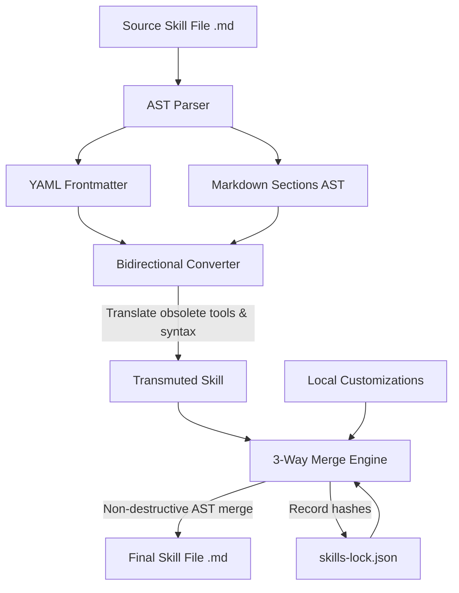

# Skills Transmuter 🌀

> **Transmute AI Agent Skills across Claude Code, Gemini, Antigravity, Codex, and MCP Ecosystems**

[](https://opensource.org/licenses/MIT)
[](https://modelcontextprotocol.org)
[](#)
[](#)
[](#)

---

### Unlock and convert agentic capabilities seamlessly. 

**Skills Transmuter** is a lightweight, high-performance developer tool and Model Context Protocol (MCP) server designed to translate, port, and adapt custom **AI agent skills** across different execution environments. It bridges the gap between client frameworks like **Claude Code**, Google's **Antigravity**, **Gemini** API daemons, and **Codex** environments by transmuting skill sets, prompts, and local scripts into standard **Model Context Protocol (MCP)** tools and native agent commands.

---

## Core Engine Architecture

`skills-transmuter` is powered by a modular three-tier architecture designed to parse, translate, and merge agent capabilities losslessly. The core pipeline consists of a Markdown AST parser, a bidirectional tool converter, and a state-aware 3-way merging engine.



### 1. AST Parser (YAML Frontmatter + Markdown Headers)

The parser (`parser.ts`) avoids naive regex-based text processing in favor of a structured Abstract Syntax Tree (AST) representation of markdown files. It decomposes skill files into semantic, atomic nodes:

*   **YAML Frontmatter Parser**: Reads and extracts metadata header blocks (bounded by `---`). It parses fields such as `name`, `description`, `version`, and other configuration tags into strongly-typed objects while preserving formatting and comments.
*   **Markdown Header Segmentation**: Segments the remainder of the document using markdown headings (`#`, `##`, `###`) as natural boundaries. Each section is stored as an object containing its title, heading depth, and raw content body.
*   **Lossless Reconstruction**: Re-assembles the AST back into a standard markdown file (`stringifySkill`) without altering surrounding formatting, code block fences, or inline comments.

```typescript
export interface MarkdownSection {
  title: string;
  depth: number;
  content: string;
}

export interface ParsedSkill {
  frontmatter: Record<string, any>;
  sections: MarkdownSection[];
  rawContent: string;
}
```

### 2. Bidirectional Converter (Tool & Syntax Mapping)

The converter (`converter.ts`) acts as a translation layer between different agent platforms (such as Claude Code, Codex, and Antigravity/Gemini). It updates outdated instructions and maps tools dynamically:

*   **Tool Command Mapping**: Scans the text and code snippets to replace deprecated or platform-specific tool invocations with their modern equivalents:
    *   `spawn_agent` / `invoke_agent` $\rightarrow$ `invoke_subagent`
    *   `read_file` / `view` $\rightarrow$ `view_file`
    *   `grep` $\rightarrow$ `grep_search`
    *   `wait_for_agent` $\rightarrow$ `schedule`
*   **Multimodal API Optimization**: Replaces complex, custom scripted OCR or image extraction loops with native multimodal vision instructions (leveraging `view_file` which supports images/PDFs natively in Gemini 3.x Flash/Pro).
*   **Concurrency & Parallelization**: Automatically refactors serial workflows into concurrent subagent execution chains using `invoke_subagent` (supporting shared or isolated workspaces).

### 3. 3-Way Sifting/Merge Engine & `skills-lock.json`

To enable seamless updates from upstream repositories without overwriting local user adaptations, the engine (`merge-engine.ts`) utilizes a 3-way diffing algorithm backed by a tracking database (`skills-lock.json`).

```json
{
  "skills": {
    "social-media-analyzer": {
      "sourcePath": ".antigravity/skills/social-media-analyzer/SKILL.md",
      "targetPath": "lib/skills/social-media-analyzer/SKILL.md",
      "lastMigration": "2026-05-25T11:08:01Z",
      "sourceHash": "a1b2c3d4...",
      "targetHash": "e5f6g7h8...",
      "userCustomized": true
    }
  }
}
```

*   **State Tracking**: The lockfile records cryptographic SHA256 hashes of both the original upstream version (`sourceHash`) and the locally modified version (`targetHash`). If the local hash differs from the recorded target hash, the skill is flagged as `userCustomized: true`.
*   **Section-Level 3-Way Merge**: Instead of line-by-line text merging which frequently results in corrupted markdown formatting, the engine merges sections individually by matching their AST headers.
    *   **Base (Recorded Source)**: The common ancestor before local modifications or upstream updates.
    *   **Local (User Version)**: The current customized file in the workspace.
    *   **Remote (Upstream Version)**: The newly updated version of the skill.
*   **Conflict Resolution**: If a section has been modified both locally and upstream, the engine inserts standard conflict markers (`<<<<<<< LOCAL`, `=======`, `>>>>>>> REMOTE`) around the conflicting block and marks the status as `CONFLICT` for manual resolution.

---

## Interactive CLI & TUI

The system includes a robust, interactive Command-Line Interface (CLI) and Terminal User Interface (TUI) designed to ease the management, auditing, and exploration of your developer workspaces.

### Workspace Auto-Detection

The CLI employs a smart multi-tiered resolution algorithm to automatically detect active workspaces. It scans the filesystem in the following hierarchical order:

1.  **Current Working Directory (`./`)**: Inspects the folder from which the command was run for standard project markers (e.g., `.antigravity/`, `.agents/`, or `.claude/`).
2.  **Parent Directory Traversal (`../`)**: Recursively traverses upward through parent folders until a project root is located.
3.  **Home Folder Presets (`~/Developer`, etc.)**: Falls back to user-defined workspace presets or standard config paths in the home directory if no local workspace is resolved.

### TUI Folder Browser

For situations requiring manual overrides or multi-workspace management, the CLI transitions into an interactive TUI folder browser:

```text
┌── Select a Workspace Directory ───────────────────────────────────────────┐
│                                                                           │
│   ▸  📁  /absolute/path/to/my-project                                     │
│      📁  /absolute/path/to/my-project/app                                 │
│      📁  /absolute/path/to/my-project/components                          │
│      📁  /absolute/path/to/my-project/lib                                 │
│                                                                           │
│  [↑/↓] Navigate  [Enter] Confirm  [Esc] Go Up  [q] Quit                   │
└───────────────────────────────────────────────────────────────────────────┘
```

*   **Keyboard-Driven Navigation**: Seamlessly navigate folder trees using arrow keys (`↑` / `↓`).
*   **Breadcrumb Paths**: View real-time breadcrumbs and absolute paths of the selected targets.
*   **Instant Activation**: Select any folder with `Enter` to instantly spin up the context or load configurations.

### Date-Based Audit Matrix

Track, audit, and compare active workspaces and configurations dynamically. The CLI features a simplified, date-based audit matrix that lists recent snapshots, highlighting the newest version so you can easily track state drift:

```text
┌───────────────────────── Unified Skills Audit Matrix ─────────────────────────┐
│                                                                               │
│  Skill Name             │ Claude Code            │ Codex          │ Antigravity   │
│ ────────────────────────┼────────────────────────┼────────────────┼────────────── │
│  social-media-analyzer  │ 2026-05-17             │ 2026-05-18     │ ⭐ 2026-05-25  │
│  database-manager       │ ⭐ 2026-05-17           │ 2026-05-18     │ 2026-05-25    │
│  web-scraper            │ 2026-05-17             │ ⭐ 2026-05-19   │ 2026-05-25    │
│                                                                               │
└───────────────────────────────────────────────────────────────────────────────┘
```

*   **Freshest Target Indicator (⭐)**: The absolute newest state or snapshot in the audit matrix is highlighted with a star icon for instant recognition.
*   **State Verification**: Ensures you are working on the most recent codebase branch or configuration before executing workflows.

---

## Agent-Aware & Automation Mode

When executed by an AI agent, the tool automatically adapts its behavior to ensure safe, predictable, and parseable output.

### Features

*   **Safe Plain-Text Markdown Tables**: When the tool detects an agent runtime or non-TTY environment, it formats data into clean, standard Markdown tables instead of complex, ANSI-colored terminal UI components. This makes output easy for LLMs to parse and understand.
*   **Dry-Run Mode (`--dry-run`)**: Run any command with the `--dry-run` flag to preview changes before they are actually applied. This is critical for agents to validate planned operations without committing changes.
*   **Skill Filtering (`--skills`)**: Target and execute only specific skills by passing a comma-separated list to the `--skills` flag (e.g., `--skills social-media-analyzer,web-scraper`), reducing context size and overhead.

### Semantic Exit Codes

The tool returns structured exit codes to help agents programmatically determine the outcome of a command:

| Exit Code | Status | Description / Agent Behavior |
| :---: | :--- | :--- |
| **`0`** | **Success** | The operation completed successfully (or target is already synced). |
| **`2`** | **Cancelled** | The operation was aborted or cancelled by the user/agent. |
| **`3`** | **Conflict** | Merge conflicts were detected during sifting. Manual resolution required. |

---

## Installation & CLI Usage

### Installation

You can install and run `skills-transmuter` globally, locally as a project dependency, or execute it directly without installation using `npx`.

#### 1. Global Installation
```bash
npm install -g skills-transmuter
```

#### 2. Local Installation
```bash
npm install --save-dev skills-transmuter
```

#### 3. Direct Execution (npx)
```bash
npx skills-transmuter [command] [options]
```

---

### CLI Usage

```text
🔄 Skills Transmuter & Sync Engine - Help

Usage:
  skills-transmuter [command] [options]

Commands:
  migrate                     Starts the migration wizard (default).
  mcp                         Starts the background stdio MCP server.
  guidelines                   Prints framework best practices guidelines (use with -t/--target).
  template list               Lists standard productivity templates.
  template install <name>     Scaffolds a basic productivity template.

Options for 'migrate':
  -d, --dir <path>            Target workspace path.
  -p, --preset <name>          Quick scan preset (Developer, Documents).
  -t, --target <framework>     Target framework: antigravity, claude, codex.
  -s, --strategy <policy>      Migration strategy: freshest, force-codex, force-claude, force-antigravity.
  -y, --yes                    Silent execution. Skips TUI prompts and confirmations.
  -l, --log <format>           Logging format: plain (default) or json.
  --dry-run                    Preview migration actions without writing files.
  --skills <list>              Comma-separated names of specific skills to migrate.
  -h, --help                   Displays this help menu.
```

### Subcommands Reference

#### `migrate`
The default subcommand. It runs a wizard to scan, transmutate, and sync skills across frameworks.
*   **Interactive Mode**: Run `skills-transmuter migrate` without the `-y/--yes` flag in a normal terminal.
*   **Agent/CI (Silent) Mode**: Run with `-y` or `--yes` to skip all interactive TUI prompts and run fully non-interactively. This mode is auto-detected if run by an AI agent.

#### `guidelines`
Outputs the target framework's best practice optimization guidelines to `stdout`.
*   **Usage**: `skills-transmuter guidelines --target <framework>` (e.g. `antigravity`, `claude`, or `codex`).

#### `template`
Manages standard productivity templates.
*   **List available templates**: `skills-transmuter template list`
*   **Install a template**: `skills-transmuter template install <template-name>` *(Example: `skills-transmuter template install scqa-framework`)*

---

## MCP Server Integration & Development

### Connecting to Claude Desktop

`skills-transmuter` functions as a standard Model Context Protocol (MCP) server. To connect it to your Claude Desktop client, add the following entry to your configuration file:

*   **Path**: `~/Library/Application Support/Claude/claude_desktop_config.json` (macOS) or `%APPDATA%\Claude\claude_desktop_config.json` (Windows)

```json
{
  "mcpServers": {
    "skills-transmuter": {
      "command": "node",
      "args": ["/absolute/path/to/skills-transmuter/dist/index.js", "mcp"]
    }
  }
}
```

### Exposed MCP Tools

Once connected, the agent will have access to the following tools:

| Tool Name | Input Schema | Description |
| :--- | :--- | :--- |
| **`inspect_workspace`** | `{ projectRoot: string }` | Scans workspace directories and returns a filtered list of active skills. |
| **`convert_skill`** | `{ rawContent: string, targetFramework?: string }` | Converts markdown skill code bidirectionally. |
| **`install_skill`** | `{ projectRoot: string, skillName: string, content: string }` | Installs or updates a converted skill in the target directory. |
| **`get_optimized_guidelines`**| `{ targetFramework?: string }` | Returns target framework coding and structure guidelines. |

---

## Developer Guide

### Prerequisites
*   Node.js (version 18 or higher)
*   npm, yarn, or pnpm

### Getting Started
1.  Clone the repository:
    ```bash
    git clone https://github.com/KronixDev/skills-transmuter.git
    cd skills-transmuter
    ```
2.  Install dependencies:
    ```bash
    npm install
    ```
3.  Build the bundle:
    ```bash
    npm run build
    ```
4.  Run unit tests:
    ```bash
    npm run test
    ```
    *(Powered by **Vitest** for quick, concurrent tests).*

---

## Contributing

Contributions are welcome! Please read our [Contributing Guide](CONTRIBUTING.md) to learn how to set up the project locally and submit pull requests.

---

## Security

If you discover a vulnerability or security issue, please review our [Security Policy](SECURITY.md) for instructions on how to report it privately.

---

## License

This project is licensed under the MIT License. See the [LICENSE](LICENSE) file for details.
